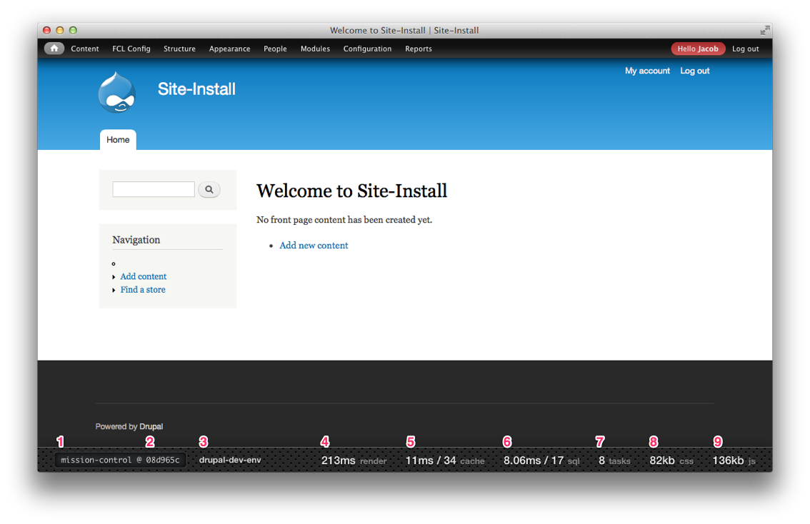

# Mission Control

Mission Control is a lightweight application performance monitoring module that
aims to give you a high level overview without the added bloat that other
modules do.

### Features

- Git integration for fetching the current branch and HEAD SHA. (1 + 2)
- Show the current host where the application is being executed from. (3)
- Page render times. (4)
- Number of cache calls from multiple backends and total call time. (5)
- Total SQL queries count for the page load and total call time. (6)
- Number of batch processes currently running. (7)
- Total count of running queues. (8)
- Size of CSS and JS files being served to the end user. (9 + 10)
