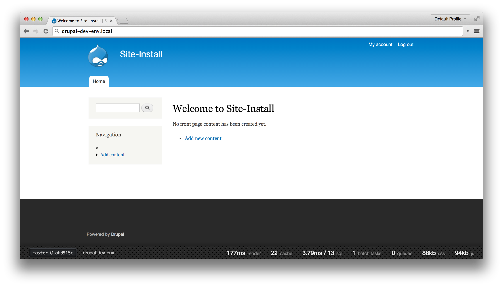
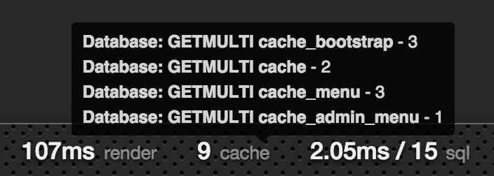
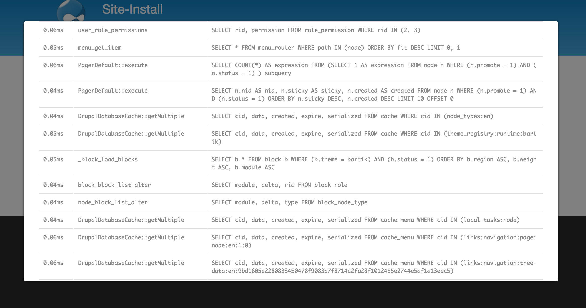

# Mission Control

Mission Control is a lightweight application performance monitoring module that
aims to give you a high level overview without the added bloat that other
modules do.

### Features



- Git integration for fetching the current branch and HEAD SHA. (1 + 2)
- Show the current host where the application is being executed from. (3)
- Page render times. (4)
- Number of cache calls from multiple backends and total call time. (5)
- Total SQL queries count for the page load and total call time. (6)
- Number of batch processes currently running. (7)
- Total count of running queues. (8)
- Size of CSS and JS files being served to the end user. (9 + 10)

#### Metric insights

To get a high level overview, you can hover a metric name (such as 'cache')
and it will give you a quick breakdown. In most cases it is broken up as `[call
type] - [call count]`.



Should you need a further breakdown of the metrics provided, click on the
topic name and a modal will appear with more information.



### Installation

- Clone the repository into your respective modules directory (usually found at
`sites/all/modules`).

  ```bash
  git clone https://github.com/jacobbednarz/mission_control.git
  ```

  Alternatively, just download the [latest](https://github.com/jacobbednarz/mission_control/archive/master.zip)
  archive.

- Navigate to `admin/modules`, find "Mission Control" and enable it.
- To configure what you wish to display, navigate to `admin/config/development/mission_control`

### Reporting bugs or feature requests

If you find an issue or something that doesn't quite work as you think it
should, open an [issue](https://github.com/jacobbednarz/mission_control/issues/new)
with the bug tracker on GitHub - Bonus points if you submit a pull request
which patches the problem!
